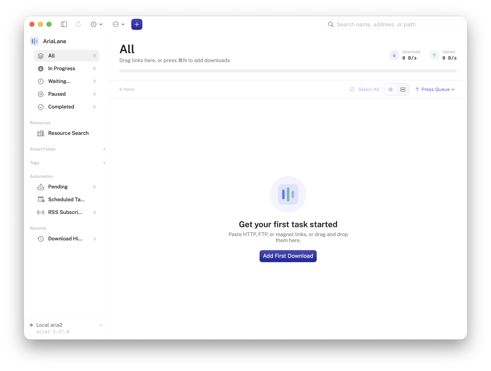

# AriaLane

[](README.md)
[](LICENSE)


AriaLane is a minimal, native aria2 desktop client for macOS. It can connect
automatically to a local `aria2c` process and manage multiple remote aria2
JSON-RPC servers.

Current version: **1.0.0**

Author: rinran ([a@rinran.me](mailto:a@rinran.me))



## Features

### Download management

- Add HTTP, HTTPS, FTP, SFTP, and magnet links
- Extract and filter download links from one or more web pages, with optional
  JavaScript rendering
- Read download links from QR codes in image files or the photo library
- Press `⌘⇧V` to prefill a task from the clipboard, or open the app from a
  browser with `arialane://add`
- Drop multiple links, `.torrent`, `.metalink`, or `.meta4` files and process
  imported files one at a time
- Select files from Torrent imports and use HTTP(S)/FTP Web Seeds
- Configure the file name, destination, per-task upload/download limits, and
  fallback mirrors
- Set Referer, User-Agent, custom headers, cookies, username, and password
- Verify SHA-1, SHA-2, or MD5 checksums and configure splits and connections
- Configure per-task proxy, TLS certificate, FTP/SFTP, BitTorrent, Metalink,
  and arbitrary aria2 options
- Pause, force-pause, resume, retry, remove, batch-process, and drag to reorder
  tasks
- Search by name, source, or path and sort by status, name, size, progress,
  speed, or queue position
- Persist links while aria2 is offline and submit them after reconnection

### Status and history

- Continuous task progress bars and aggregate list progress
- A collapsible chart of download and upload speeds for the last three minutes
- Local download history with search, sorting, redownload, and Show in Finder
- User tags shared by active tasks and download history, with batch assignment,
  context menus, and inspector editing
- Smart folders that filter dynamically by tags, content type, protocol,
  source domain, date, and task status
- Task details for file selection, mirrors, runtime options, BitTorrent peers,
  server connections, Info Hash, and piece status
- Completion and failure alerts with readable errors and quick retry

### Automation and system integration

- Schedule download tasks and edit, duplicate, start immediately, or cancel them
- Refresh RSS and Atom subscriptions on a schedule and download new enclosures
  automatically through a selected server
- Move expired schedules safely into the pending queue and use stable GIDs to
  avoid duplicate submission after recovery
- Apply overnight speed limits across midnight and restore daytime settings
- Use a menu bar mini window to view speeds and pause or resume tasks
- Show weighted aggregate progress in the Dock icon
- Optional launch at login
- Prevent automatic system sleep while downloads are active and release the
  assertion as soon as they finish
- Save the aria2 session automatically and restore unfinished tasks
- Chinese and English interfaces, following the system language or a manual
  selection

### aria2 and connectivity

- Configure and switch between multiple local or remote aria2 servers
- Keep pending tasks bound to their original server, with an option to move
  them explicitly to the current server
- Store RPC secrets in the macOS Keychain
- Receive live status over WebSocket, fall back to polling after disconnects,
  and reconnect automatically
- Use `system.multicall` for batch operations and probe supported RPC methods
  and notifications
- View aria2 version, enabled features, RPC capabilities, Session ID, task
  counts, and response latency in connection diagnostics
- Configure global and default task limits, concurrency, splits, connections,
  timeout, and retry behavior
- Configure DHT, PEX, LPD, BitTorrent ports, peer limits, and seeding rules
- Configure global proxy, TLS, cookies, FTP/SFTP, BitTorrent encryption,
  trackers, and Metalink preferences
- Save sessions, purge download results, and shut down remote aria2 normally
  or forcibly
- Configure resume, file allocation, automatic renaming, and remote timestamps

### Release support

- arm64 and x86_64 Universal Binary
- ZIP and drag-to-install DMG packages
- Optional Developer ID, Hardened Runtime, Apple notarization, and stapling
- Sparkle 2 in-app updates with EdDSA update signatures
- GitHub Actions for tests and Sparkle-enabled releases

## Languages

AriaLane 1.0.0 supports Simplified Chinese and English. Choose the language in
**Settings → General → Language**:

- The default follows the system language.
- Any Chinese system preference, including Traditional Chinese, displays the
  Chinese interface.
- An English system preference displays the English interface.
- Other system languages fall back to English.
- You can also select Simplified Chinese or English manually.
- Additional languages are being added gradually.

The English interface was translated by the local `gemma4:31b` model and may
contain mistakes or unnatural wording. If the Chinese and English meanings
differ, the original Chinese text takes precedence. Translation corrections
through Issues or Pull Requests are welcome.

## Requirements

- macOS 14 Sonoma or later
- aria2

Install aria2 with Homebrew:

```bash
brew install aria2
```

## Installation

1. Download `AriaLane-1.0.0-macOS-universal.dmg` from
   [GitHub Releases](https://github.com/rinranx/AriaLane/releases).
2. Open the DMG and drag **AriaLane** into **Applications**.
3. On first launch, right-click AriaLane in Finder's Applications folder and
   choose **Open → Open**.
4. If macOS still blocks the app, open
   **System Settings → Privacy & Security**, find the AriaLane warning, and
   choose **Open Anyway**.

The current GitHub Release uses an ad-hoc signature and has not been signed
with Apple Developer ID or notarized by Apple. Download it only from this
repository's Releases page and optionally verify it with `SHA256SUMS.txt`.
Bypass Gatekeeper only after confirming that the download source is trusted.

## Build and run

```bash
./script/build_and_run.sh
```

Common commands:

```bash
# Build the app without launching it
./script/build_and_run.sh --build

# Run tests
./script/test.sh

# Create Universal Binary ZIP and DMG packages
./script/package_release.sh
```

Without a Developer ID certificate, the packaging script uses an ad-hoc
signature and macOS requires manual approval on first launch. See the
[release guide](docs/RELEASING.md) for the complete signing and notarization
workflow.

## Use a remote aria2 server

In **Settings → Connection**, add the server name, JSON-RPC endpoint, and RPC
secret. Remote endpoints may use HTTP(S) or WS(S).

Never expose an unencrypted aria2 RPC port directly to the public Internet.
Use a strong `rpc-secret` and connect through a trusted VPN or a TLS-enabled,
access-controlled reverse proxy. See the [security policy](SECURITY.md).

## Add downloads from a browser

AriaLane registers a URL scheme that is used only to add tasks. Browser
extensions, Shortcuts, and other apps can open:

```text
arialane://add?url=https%3A%2F%2Fexample.com%2Ffile.zip
```

External links only open and prefill the Add Download window. They never start
a download silently; the user must confirm first.

## Keyboard shortcuts

- `⌘N`: Add a download
- `⌘⇧V`: Add from clipboard
- `⌘O`: Import Torrent / Metalink
- `⌘R`: Refresh tasks
- `⌘⇧P`: Pause all
- `⌘⇧R`: Resume all
- `⌘,`: Open Settings

## Contributing

Read the [contribution guide](CONTRIBUTING.md) before submitting changes.
Do not open a public Issue containing vulnerability details or credentials;
report security issues privately according to the
[security policy](SECURITY.md).

## Privacy and license

AriaLane contains no telemetry, advertising, or account system. See
[PRIVACY.md](PRIVACY.md) for details about data handling.

This project is licensed under the
[GNU General Public License v3.0 only](LICENSE) (`GPL-3.0-only`).
Copyright: [rinran (a@rinran.me)](COPYRIGHT).
Author on X: [@rinran223](https://x.com/rinran223).
See [THIRD_PARTY_NOTICES.md](THIRD_PARTY_NOTICES.md) for third-party licenses.
